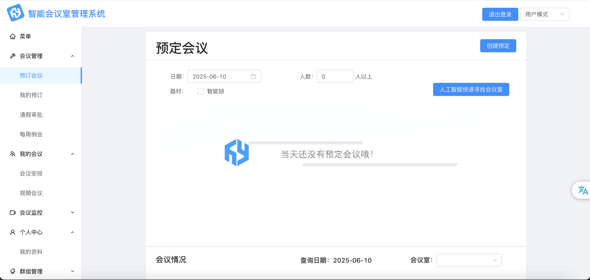

# iMeeting

**iMeeting** is a full-stack meeting management platform that simplifies scheduling and coordination within groups and departments. It integrates a Java backend with a React frontend, providing a seamless user experience.

---

## Components

- [`emms/`](./emms) — Java backend using Maven  
- [`front-end/`](./front-end) — React frontend UI

---

## Project Structure

```
iMeeting/
├── emms/          # Backend (Java, Maven)
├── front-end/     # Frontend (React)
└── README.md      # This file
```

## Configuration & How to run

### Database & Redis
- Go to file application.properties and configure DB connection and Redis accordingly
- Add relevant dependencies if using non-MySQL databases in pom.xml
- Import provided SQL schema by running dump-imeeting.sql
- Start the Redis server with: `redis-server`

### Backend
- Build and run with Maven

### Frontend
- Install required dependencies with npm
- Configure URL setup in global.js if needed
- Run with `npm start`

## Sample View

